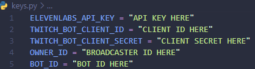

# TheBot580

## **WARNING**! THIS IS THE V2 VERISON OF THE BOT, USING THE LATEST VERSION OF ALL APIs

### If you plan on using this version, make sure all plugins (TwitchIO, Azure, PyGame, OBS Websockets, and requests) are up to date (run `pip install -r requirements.txt` to install and update everything)

This is a fork of [Babagaboosh ↗](https://www.github.com/DougDougGithub/Babagaboosh), changed as a bot for [TheFox580 ↗](https://www.twitch.tv/thefox580), [TheAlt580 ↗](https://www.twitch.tv/thealt580), [TheEvents580 ↗](https://www.twitch.tv/theevents580) and [LeRenard580 ↗](https://www.twitch.tv/lerenard580)

This code uses the TwitchIO **3.1.0** Library, Azure's Text-To-Speech fonctionnality, PyGame's Audio Library and OBS Websockets.

## Here are all of TheBot580's functionnality

### Moderator Bot

**TheBot580 will detect bots based on a banned word list, and if **ANY** of these words are detected in the message, the user will be permanently banned from the channel**

---

### Support for TTS message

**TheBot580 will by default enable Text-To-Speech messages, meaning that any safe messages will be read out loud by the progam!**

> *Note* : This setting can be disabled by putting `self.tts = False`

> *Tip* : If you're streaming with TTS Enabled, you can use a plugin like [*win-capture-audio ↗*](https://github.com/bozbez/win-capture-audio) and make it output `python.exe` to have TTS on a separate audio channel!

> *Tip* : With this plugin and the [*Move plugin ↗*](https://github.com/exeldro/obs-move-transition), you can make a png move like TheBot580 was actually talking with the use of OBS Websockets

---

### Support for Emote Combos

**TheBot580 will automatically count how many times in a row an emote has been used, and will send a message if the emote has been said at least 5 times!**

> *Tip* : You can modify the message that the bot sends in chat to your liking here

---

### Use advanced commands

**Thanks to TwitchIO 3.0.0+, we now have more control on how to use bot commands! *You can check some I have already set up!***

---

### Support for any streamer

> **Warning** : Any checked interaction requires you to be either an **Affiliated or Partenred streamer**

> *Tip* : *🆙* means this interaction has been updated & *🆕* means this interaction has been added

**TheBot580 uses EventSub to allow for interactive moments with chat! So far, TheBot580 interacts with :**

* [ ] **New Follower**
* [x] **New Subscriber**
* [x] **Resubscriptions**
* [x] **Normal / Anonymous Gifted Subscriptions**
* [x] **Normal / Anonymous Cheer Message**
* [x] **Prediction Begins**
* [x] **Prediction Locks**
* [x] **Prediction Ends**
* [x] **Poll Begins**
* [x] **Poll Ends**
* [ ] Stream **Starts** and **Ends**
* [x] **Golden / Treasure / Normal (Shared) Hype Train Begins**
* [x] **Golden / Treasure / Normal (Shared) Hype Train Progress**
* [x] **Golden / Treasure / Normal (Shared) Hype Train Ends**
* [ ] **Shared Chat Collaboration Begins** *🆙 | This has been disabled by default because it's broken and I need to fix it.*
* [ ] **Shared Chat Collaboration Updates (User join / left)** *🆙 | This has been disabled by default because it's broken and I need to fix it.*
* [ ] **Shared Chat Collaboration Ends** *🆙 | This has been disabled by default because it's broken and I need to fix it.*
* [x] **Follower / Subcription / Cheer Goal Begins**
* [x] **Follower / Subcription / Cheer Goal Progress**
* [x] **Follower / Subcription / Cheer Goal Reached**
* [ ] **Raid** *(Gives an automatic shoutout)*
* [ ] **Title & Category Update**
* [ ] **Shoutout Created**
* More to come...

> *Note* : If you don't know how to start TheBot580 (especially for the 1st time), read the [*TwitchIO tutorial ↗*](https://twitchio.dev/en/latest/getting-started/quickstart.html) on how to start the bot!

## IT IS MORE THAN ADVISED TO KNOW PYTHON (otherwise you can't understand what this code does and this is kinda dumb...)

### BEFORE STARTING THE CODE, PLEASE READ (and modify, if you want) `tts.py`, `websockerts_auth.py` AND `twitch_bot.py`

### CREATE A `keys.py` WITH AT LEAST 7 VARIABLES NAMED

* `AZURE_TTS_KEY`
* `AZURE_TTS_REGION`
* `AZURE_TTS_VOICE` ([*Click here to see all voices available ↗*](https://learn.microsoft.com/en-us/azure/ai-services/speech-service/language-support?tabs=tts#tabpanel_1_tts))
* `TWITCH_BOT_CLIENT_ID`
* `TWITCH_BOT_CLIENT_SECRET`
* `OWNER_ID`
* `BOT_ID`

### THESE KEYS MUST EXIST WITHIN `keys.py`

Example of `keys.py`:

## ALSO YOU NEED OBS TO BE OPEN FOR THE BOT TO WORK BECAUSE IT CONNECTS TO OBS THROUGH WEBSOCKETS
